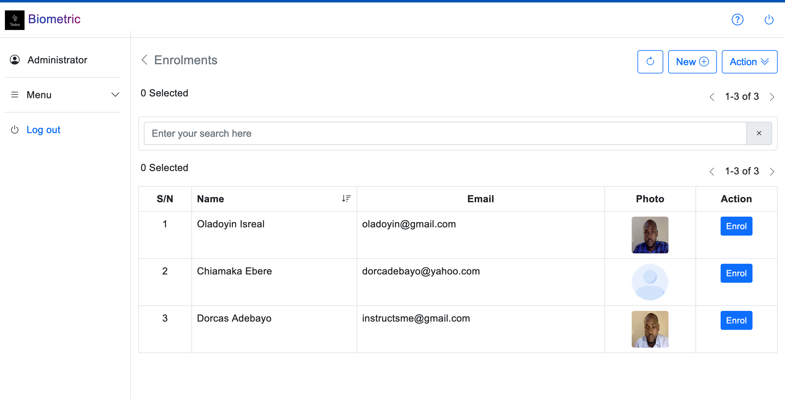

**Developer: Shuaib B. A
Email: instructsme@gmail.com**

## Face Recognition system  using Deepface framework, vueJs, WebRtc and Django framework!

This project is a simple face recognition application which was developed with the latest technology (vueJs, WebRtc and Django). 

Deepface python framework is a lightweight face recognition and facial attribute analysis such as for age, gender, emotion , and race.

**WebRTC**
WebRTC is a free and open-source project that provides web browsers and mobile applications with real-time communication via application programming interfaces to capture and optionally stream audio and/or video media. 

## Requirements
You can use **pip** command to install the following.

 1. django
 2. pandas
 3. mysqlclient
 4. deepface

## Installation

 - Create a virtual environment and install the requirements
 - Make a pull request to extract this project to your project root
 - Create MySql Database and setup a database name and password in the app settings

## To run the App
I believe you have basic knowledge of running Django app.
At your root directory, Type: Change path to the **backend**
To run, type: **python manage.py runserver**

## Database
Check the root folder

## Screenshots

**Home page**

**Users**

**Enrolment**

**Sign In**

